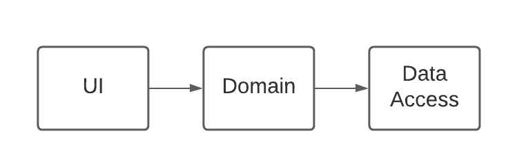
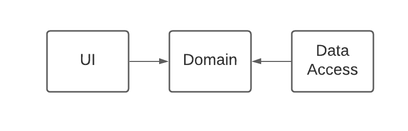

# Intro
We have two examples here: `tightlycoupled` and `looselycoupled` which
are taken from the [book](https://www.amazon.com/gp/slredirect/picassoRedirect.html/ref=pa_sp_atf_stripbooks_sr_pg1_1?ie=UTF8&adId=A02738679T215RLHBK7D&url=%2FDependency-Injection-Principles-Practices-Patterns%2Fdp%2F161729473X%2Fref%3Dsr_1_1_sspa%3Fcrid%3DXHDMN7N6RQ24%26dchild%3D1%26keywords%3Ddependency%2Binjection%26qid%3D1631200257%26s%3Dbooks%26sprefix%3Ddependency.%2B%252Cstripbooks%252C130%26sr%3D1-1-spons%26psc%3D1&qualifier=1631200257&id=3977972627987957&widgetName=sp_atf)
adapted into Django.

## Tightly-coupled

A major goal of building a three-layer application is to separate concerns. 
We’d like to separate our domain model from the data access and UI layers so 
that none of these concerns pollute the domain model.

Evaluating possible **replacements** helps us see if our system is loosely-coupled or not. 

### UI
Could we replace the UI while reusing the data-access layer and domain layer? We could
because neither the domain (Product, ProductService) nor the data-access (models) depend
on the UI. 

### Data-access
Could we replace the data-access layer to use a more scalable and efficient graph-based
solution instead of relational databases, without touching the other layers? 

We can't: out ProductService (domain) directly uses the data-access, and our UI (templates)
indirectly used django model instances. So we would have to replace all 3 layers together.

### Domain
Our domain model is tightly-coupled to the ORM (data-access layer. Or better put,
there is no domain model, but ORM models given by django. So there is no domain outside
the database)

Our dependency graph right now looks something like this: 



Using django's ORM is perfectly fine, however coupling the domain-layer into
the ORM is what causes trouble. The offending code is in the services, we are
returning ORM objects from the domain layer:

```python
# services.py

def get_featured_products():
    return ProductDTO.objects.filter(...)
```

So what does the desired dependency graph look like? Usually the purpose of an application
is to provide solutions to a domain problem, so replacing the Domain layer makes no sense at
all. However, the UI and data-access are dispensable. The diagram looks like:




The tightly-coupled project suffers can't reap the following benefits from 
loosely-coupled code:

#### Late binding
For instance if in production we wanted to use a Cloud storage solution but in local
development a simple database, it wouldn't be possible to do so by using late binding.
In other words, it’s impossible to load the correct data access layer using late binding.

#### Maintainability
Adding cross-cutting concerns would require changes that span across many classes and
layers. Every new concern addressed will make the existing code more complex and
un-maintainable

#### Parallel development
If we stick with the previous example of applying Cross-Cutting Concerns, 
it’s quite easy to understand that having to make sweeping changes throughout your code base
hinders the ability to work with multiple developers in parallel on a single application. 
Like us, you’ve likely dealt with painful merge conflicts in the past when committing your work
to a version control system. A well-designed, loosely coupled system will, among other things,
reduce the amount of merge conflicts that you’ll have

#### Testability
The domain model is impossible to unit-test as we don't have a domain without a database.
Integration tests may be possible, but even then some parts will need to be swapped out
by fakes, not easy with our current implementation.

#### No real domain model
The domain model is the ORM itself. Whereas it’s a technical problem that the domain layer
references the data access layer, it’s a conceptual problem that the data access layer defines
such a class as the Product class. A domain Product class belongs in the domain model.

#### 